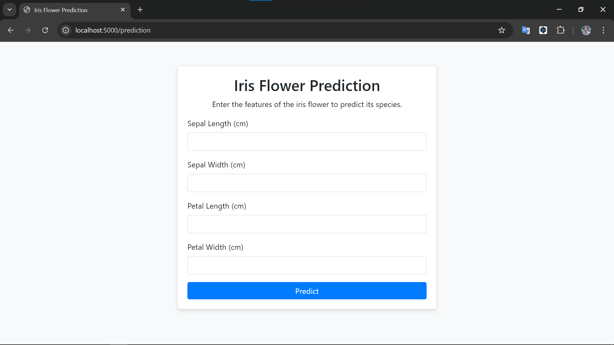

# Iris Classification ML Project Workflow
---

# How to run?

## **Step 1: Clone the repository :**

```bash
git clone https://github.com/AnggaDS01/Iris-Classification-ML-Project.git
```
## **Step 2: Create a virtual environment after opening the repository:**

### Python 3.4 and above
If you are running Python 3.4+, you can use the venv module baked into Python

```bash
# python -m venv <directory>
python -m venv venv
```

### Windows venv activation
To activate your venv on Windows, you need to run a script that gets installed by venv. If you created your venv in a directory called venv, the command would be:

```bash
# In cmd.exe
venv\Scripts\activate.bat
# In PowerShell
venv\Scripts\Activate.ps1
```

### Linux and MacOS venv activation
On Linux and MacOS, we activate our virtual environment with the source command. If you created your venv in the myvenv directory, the command would be:

```bash
$ source myvenv/bin/activate
```

## **Step 3: install the requirements**
```bash
pip install -r requirements.txt
```

## **Step 4: run python app.py in bash**
```bash
# Finally run the following command
python app.py
```

## **Step 5: Open Your Web Browser**
Open any web browser of your choice (such as Chrome, Firefox, Edge, or Safari)

## **Step 6: Access the Flask Application**
To access the Flask application, enter the following URL in the browser's address bar:

```
http://localhost:5000/prediction
```

the number 5000 indicates the port that will be accessed, and will display the following result:



## **Step 7: Make Predictions**
Enter the required input data in the prediction form and submit it to see the model's prediction results displayed on the page.
The prediction result will appear below the form, formatted nicely to show the prediction outcome.

<table>
    <tr>
        <td>sepal_length</td>
        <td>sepal_width</td>
        <td>petal_length</td>
        <td>petal_width</td>
        <td>species</td>
    </tr>
    <tr>
        <td>5.1</td>
        <td>3.5</td>
        <td>1.4</td>
        <td>0.2</td>
        <td>Iris-setosa</td>
    </tr>
    <tr>
        <td>7</td>
        <td>3.2</td>
        <td>4.7</td>
        <td>1.4</td>
        <td>Iris-versicolor</td>
    </tr>
    <tr>
        <td>6.3</td>
        <td>3.3</td>
        <td>6</td>
        <td>2.5</td>
        <td>Iris-virginica</td>
    </tr>
</table>

Use the example above to find out the prediction result, or use the following link to get the dataset from iris: https://www.kaggle.com/datasets/uciml/iris

# How to Containerize the Project with Docker (optional)
Step 1: Install Docker
Before you can run the Docker container, you need to have Docker installed on your machine. You can download Docker from the official [Docker website](!https://www.docker.com/products/docker-desktop/).

### **Step 2: Initialize Docker Setup**

First, ensure that your repository contains a `Dockerfile`. Here is a sample `Dockerfile` to get started:

```Dockerfile
# Use an official Python runtime as a parent image
FROM python:3.9-slim

# Set the working directory in the container
WORKDIR /app

# Copy the current directory contents into the container at /app
COPY . /app

# Install any needed packages specified in requirements.txt
RUN pip install --no-cache-dir -r requirements.txt

# Make port 5000 available to the world outside this container
EXPOSE 5000

# Run app.py when the container launches
CMD ["python", "app.py"]
```

### **Step 3: Create a `.dockerignore` File**

Create a `.dockerignore` file in the root of your project directory to prevent unnecessary files from being included in the Docker image. This will speed up the build process and reduce the image size.

Example `.dockerignore`:

```plaintext
__pycache__
*.pyc
*.pyo
*.pyd
venv/
.env
iris_classification_ml_project.egg-info
```

### **Step 4: Build the Docker Image**

Navigate to the root directory of your project where the `Dockerfile` is located and run the following command to build your Docker image:

```bash
docker build -t iris-classification-ml-app:latest .
```

This command will build the Docker image with the tag `iris-classification-ml-app:latest`.

### **Step 5: Run the Docker Container**

Once the image is built, you can run the Docker container using the following command:

```bash
docker run -p 5000:5000 iris-classification-ml-app:latest
```

This command will start a Docker container and map port 5000 inside the container to port 5000 on your local machine. You can access the Flask app by visiting `http://localhost:5000` in your web browser.

### **Step 6: Test the Application in Docker**

Open your web browser and go to `http://localhost:5000` to ensure your application is running correctly inside the Docker container.

### **Step 7: Stop the Docker Container**

To stop the running Docker container, press `Ctrl + C` in the terminal window where the container is running, or use the following command to stop the container:

```bash
docker ps  # This shows the running containers with their container IDs.
docker stop <container_id>  # Replace <container_id> with your container's ID.
```

TEST BRANCH